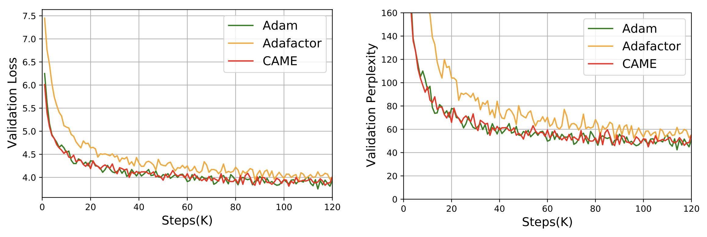

<h1 align="center">CAME Optimizer</h1>
<h3 align="center">ACL 2023 Outstanding Paper Award<br/>Confidence-guided Adaptive Memory Efficient Optimizer</h3>

This is an official implementation of **CAME** optimizer in the "[Confidence-guided Adaptive Memory Efficient Optimizer](https://arxiv.org/abs/2307.02047)". Please cite the paper and star this repo if you find CAME useful. Thanks!

## Method

In this work, we studied a confidence-guided strategy to reduce the instability of existing memory efficient optimizers. Based on this strategy, we proposed CAME to simultaneously achieve two goals: fast convergence as in traditional adaptive methods, and low memory usage as in memory-efficient methods.


## Usage

```python
from came_pytorch import CAME
optimizer = CAME(
  model.parameters(),
  lr=2e-4,
  weight_decay=1e-2,
  betas=(0.9, 0.999, 0.9999),
  eps=(1e-30, 1e-16)
)
```

## Experiments

Apart from the BERT and T5 experiments shown in the paper, we conduct more and record the results here.

### Fine-tuning LLaMA-7B

|                | MMLU      | WikiText | Hellaswag | TruthfulQA (MC) | BoolQ     | COPA      | WSC       | WIC       |
| -------------- | --------- | -------- | --------- | --------------- | --------- | --------- | --------- | --------- |
| Alpaca-7B      | 40.21     | 6.74     | 59.76     | **38.89**       | **79.57** | **88.00** | 46.15     | 49.84     |
| Alpaca-7B-CAME | **40.59** | **6.38** | **59.80** | 38.61           | 79.08     | **88.00** | **49.04** | **50.78** |

The fine-tuning of LLaMA-7B is mainly based on [stanford-alpaca](https://github.com/tatsu-lab/stanford_alpaca) by changing the default optimizer "adamw" to "came" and adding the CAME optimzier in transformer package. The evaluation of Alpaca-7B and Alpaca-7B-CAME is based on [Instruct-eval](https://github.com/declare-lab/instruct-eval) and [lm-evaluation-harness](https://github.com/EleutherAI/lm-evaluation-harness).

### Pre-training GPT-2



The pre-training of GPT-2 is based on [Megatron-LM](https://github.com/NVIDIA/Megatron-LM) by adding the CAME optimizer in [megatron/optimizer/__init__.py](https://github.com/NVIDIA/Megatron-LM/blob/main/megatron/optimizer/__init__.py) correspondingly.

## Citation

```bibtex
@article{luo2023came,
  title={CAME: Confidence-guided Adaptive Memory Efficient Optimization},
  author={Luo, Yang and Ren, Xiaozhe and Zheng, Zangwei and Jiang, Zhuo and Jiang, Xin and You, Yang},
  journal={arXiv preprint arXiv:2307.02047},
  year={2023}
}
```
